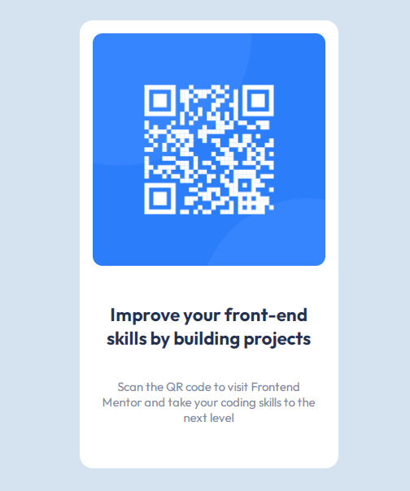

## Overview 👋

Hey, welcome!

### Screenshot

[]

This is how my project looks like.

### Links

- Solution URL: [solution URL here](https://hugo-cavalcanti.github.io/qr-code-component/)
- Live Site URL: [live site URL here](https://www.frontendmentor.io/challenges/qr-code-component-iux_sIO_H/hub)

## My process 🚀

### Built with

- Semantic HTML5 markup
- CSS properties
- Flexbox
- Mobile-first workflow

### What I learned

It was my first code challenge so it really was like put my knowledges in practice for the first time and I have to say that it was awesome. I'm really proud of how i learned to manage the concept concept of media responsiveness, the challenge of position in CSS, different displays etc.


Codes I am proud of:

```html
<div class="container">
      <div class="card">
```
```css
@media (max-width: 375px)
```

### Continued development

I would like to keep learning and improving my development. It is just the beginning for me so of course, that is a lot of areas that I want to study, like flexbox, media queries, JavaScript, new stacks etc.


### Useful resources

- [Google Fonts](https://fonts.google.com/) - This helped me for applying the required fonts of the project.

## Author

- Frontend Mentor - [@hugo-cavalcanti](https://www.frontendmentor.io/profile/hugo-cavalcanti